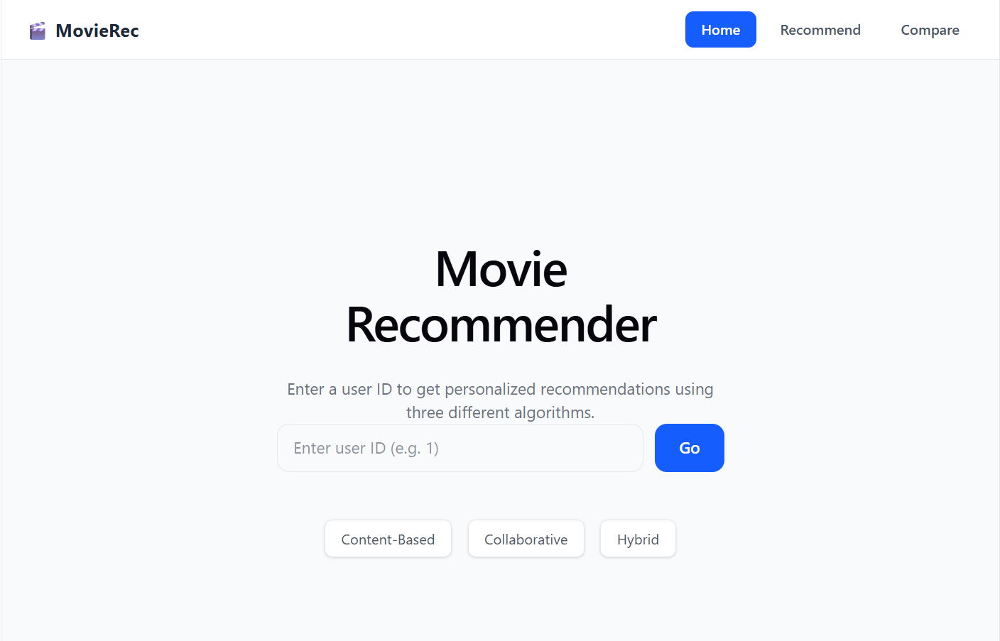
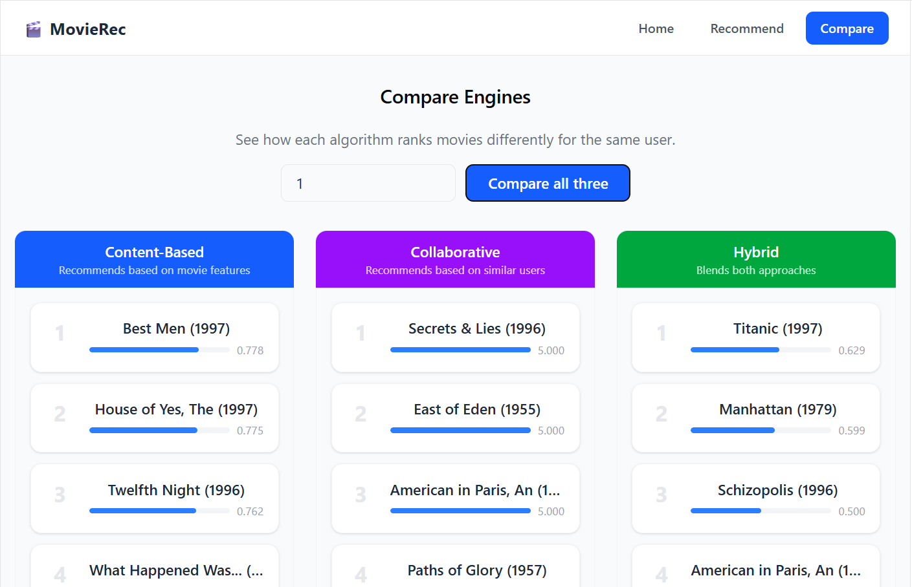
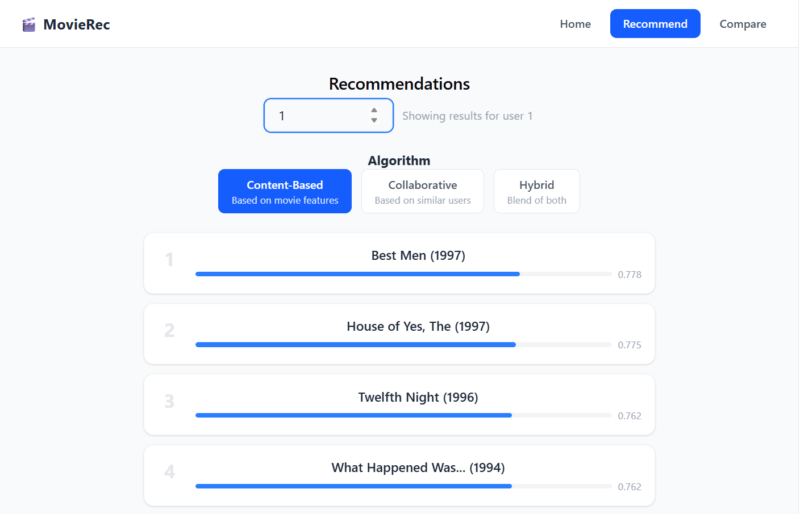

# MovieRec
This project demonstrates three recommendation algorithms built from scratch — Content-Based Filtering, Collaborative Filtering, and a Hybrid blend of both — served via a Flask REST API and visualized in a React frontend. Users can fetch personalized movie recommendations by user ID, switch between algorithms, and compare all three engines side by side to see how each approach produces different results from the same data. Built using the MovieLens 100K dataset from GroupLens Research at the University of Minnesota.

## Sceenshots
### Home Page


### Compare Page


### Recommend Page


## Tech Stack

**Backend**
- Python 3
- Flask — REST API framework
- flask-cors — cross origin request handling
- NumPy — vector math and score computation
- pandas — data loading and manipulation
- scikit-learn — cosine similarity calculations

**Frontend**
- React — UI framework
- React Router — multi-page routing
- Tailwind CSS — styling

**Dataset**
- MovieLens 100K — GroupLens Research, University of Minnesota

## Project Structure

```
recommendation-project/
├── backend/
│   ├── app.py                  # Flask entry point and API routes
│   ├── data/
│   │   └── ml-100k/            # MovieLens 100K dataset files
│   └── recommenders/
│       ├── base.py             # Abstract base class for all engines
│       ├── content_based.py    # Content-based filtering engine
│       ├── collaborative.py    # Collaborative filtering engine
│       └── hybrid.py           # Hybrid engine combining both approaches
├── frontend/
│   └── src/
│       ├── api/
│       │   └── recommendations.js  # Flask API calls
│       ├── components/
│       │   ├── Navbar.jsx
│       │   ├── MovieCard.jsx
│       │   ├── RecommendationList.jsx
│       │   └── AlgoSelector.jsx
│       └── pages/
│           ├── Home.jsx
│           ├── Recommend.jsx
│           └── Compare.jsx
```

## Running Locally

### Prerequisites
- Python 3.8 or higher
- Node.js 16 or higher
- MovieLens 100K dataset (download from https://grouplens.org/datasets/movielens/100k/)

# Backend Setup

### Clone the repository
git clone https://github.com/yourusername/recommendation-project.git
cd recommendation-project/backend

### Create and activate a virtual environment
python -m venv venv
venv\Scripts\activate        # Windows
source venv/bin/activate     # Mac/Linux

### Install dependencies
pip install -r requirements.txt

### Place the MovieLens 100K dataset in the data folder
### Your structure should look like: backend/data/ml-100k/u.data and u.item

### Start the Flask server
python app.py
### Server runs at http://localhost:5000


# Frontend Setup
```bash

### Install dependencies
npm install

### Start the development server
npm run dev
### App runs at http://localhost:5173
```

## How It Works

### Content-Based Filtering
Recommends movies based on the features of movies a user has already rated highly. 
Each movie is represented as a genre vector and the user's taste is built by taking 
a weighted average of those vectors based on their ratings. Movies most similar to 
that taste profile are recommended using cosine similarity.

### Collaborative Filtering
Recommends movies based on the behavior of similar users. A user-item rating matrix 
is built from all ratings in the dataset, and cosine similarity is used to find users 
with the most similar rating patterns. Movies that those neighbors rated highly but 
the target user hasn't seen are then recommended.

### Hybrid
Combines both approaches by running each engine independently, normalizing their 
scores to the same 0-1 scale using min-max normalization, then blending them with 
an equal 50/50 weight. This mitigates the main weaknesses of each approach — 
content-based filtering's tendency to over-specialize and collaborative filtering's 
cold-start problem.

## API Endpoints

All endpoints are served at `http://localhost:5000`

| Method | Endpoint | Description |
|--------|----------|-------------|
| GET | `/api/health` | Check server status and loaded engines |
| GET | `/api/users` | Get all available user IDs |
| GET | `/api/recommend/cbf/<user_id>` | Content-based recommendations |
| GET | `/api/recommend/cf/<user_id>` | Collaborative filtering recommendations |
| GET | `/api/recommend/hybrid/<user_id>` | Hybrid recommendations |

Optional query parameter: `?n=10` controls the number of results returned.

**Example request**
```
GET /api/recommend/hybrid/1?n=5
```

**Example response**
```
json
{
  "userId": 1,
  "engine": "hybrid",
  "count": 5,
  "recommendations": [
    { "movieId": 318, "title": "Schindler's List (1993)", "score": 0.9421 },
    { "movieId": 50,  "title": "Star Wars (1977)",        "score": 0.9187 }
  ]
}
```

## Future Improvements

- Allow users to rate movies directly in the app and see recommendations update in real time
- Add user authentication so individuals can build their own rating history
- Replace genre vectors with TF-IDF on plot descriptions for richer content-based profiles
- Make the hybrid alpha weight adjustable from the frontend UI
- Deploy the full stack — Flask on Railway or Render, React on Vercel

## Dataset

F. Maxwell Harper and Joseph A. Konstan. 2015. The MovieLens Datasets: History and 
Context. ACM Transactions on Interactive Intelligent Systems (TiiS) 5, 4: 29:1–29:19.
https://doi.org/10.1145/2827872

Dataset available at: https://grouplens.org/datasets/movielens/100k/


